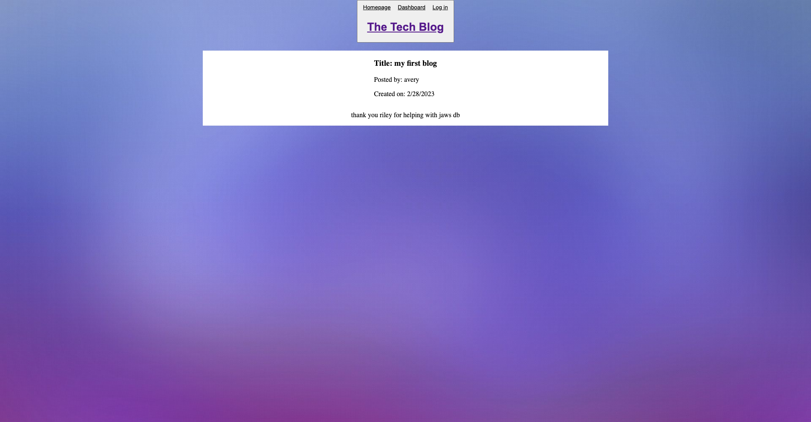

# Tech-Blog
 
  ## Table of Contents

  * [Description](#description)
  * [Installation](#installation)
  * [Usage](#usage)
  * [Contributions](#contributions)
  * [License](#license)
  * [Questions](#questions)
  
  # Description
  - You will be be greeted with the homepage. Then you must create an account that takes you to your dashboard where you can post a blog and see all of your blogs as well. Each blog post you make or others make on the server will then be posted on the homepage with the date created.

  # Installation
  - You must do these steps to make app run correctly.
  - Clone the repo, run npm i, setup your .env, and run npm start.

  ## Usage
  - https://my-tech-blog-888.herokuapp.com/
  

  ## License
  -  N/A

  ## Contributions
  - N/A

  ## Tests
  - N/A

  ## Questions
  - Contact me
  - Github: https://github.com/averynewhart
  - Email: newhartreeceavery@gmail.com